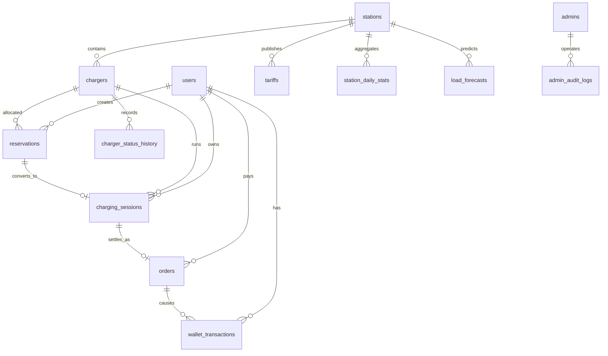

# 电动汽车充电平台数据库架构设计

## 1. 文档目的与范围

本文根据仓库中的需求矩阵和模块划分，定义用户端、PC 管理端、Socket 服务和 Web 数据看板共用的数据架构。本文只做数据库架构设计，不包含业务实现或 UI 设计。

覆盖范围：

- 手机号免密登录、个人资料、账号冻结和钱包余额；
- 电站、电桩、价格配置、设备运维和状态历史；
- 选桩预约、充电仿真、订单结算、余额不足和异常恢复；
- 充值记录、消费流水、管理员审计；
- 营收/设备看板和站点负荷预测结果。

不在本期范围：真实支付渠道、车辆档案、地图轨迹明细、消息推送内容和复杂 RBAC 权限树。这些功能可以在保留主键和审计边界的前提下扩展。

## 2. 架构决策

### 2.1 数据库选型

主部署采用 SQLite 3。Qt 服务端、Qt 管理端和 Web 看板均通过统一服务层访问数据库，客户端不直接执行任意 SQL。数据库文件由服务端统一持有，开启 WAL、外键约束和 `busy_timeout`，以支持本项目的单服务进程、多客户端并发演示。

SQLite 是本期明确的开发数据库。它适合课程项目和单机部署；若将来需要多进程高并发，再另行评估服务型数据库，不改变本设计的业务表和调用边界。

### 2.2 逻辑分层

1. **主数据层**：`users`、`admins`、`stations`、`chargers`、`tariffs`。
2. **交易层**：`reservations`、`charging_sessions`、`orders`、`wallet_transactions`。
3. **运维与审计层**：`charger_status_history`、`admin_audit_logs`、`outbox_events`。
4. **分析层**：`station_daily_stats`、`load_forecasts` 及面向看板的只读视图。

### 2.3 通用约定

- 主键使用 SQLite 的 `INTEGER PRIMARY KEY AUTOINCREMENT`；对外展示的订单号、设备编号等另设不可变的业务编号。
- 时间统一使用 ISO-8601 文本（UTC，如 `2026-09-04T01:00:00Z`），由服务端写入；展示层再转换为北京时间。
- 金额使用 `numeric(12,2)`，电量使用 `numeric(12,3)`，功率使用 `numeric(10,3)`，禁止使用浮点数保存结算金额。
- 所有表包含 `created_at`；可变主数据增加 `updated_at`。删除采用业务状态或软删除，交易和审计数据不物理删除。
- 外键默认 `on delete restrict`；只有明确的从属历史表允许 `on delete cascade`。
- 状态字段使用受约束的文本值和 `CHECK` 条件，状态变更必须在服务事务内完成。

## 3. 实体关系总览

关键基数约束：一个用户同一时刻最多一个未完成充电会话；一个电桩同一时刻最多一个有效预约/充电会话；一个充电会话最多生成一个订单。

## 4. 核心表设计

### 4.1 身份、账户和钱包

#### `users`

| 字段 | 类型 | 约束/说明 |
|---|---|---|
| `id` | bigint | PK |
| `phone` | varchar(20) | NOT NULL，唯一；保存规范化后的 11 位手机号 |
| `nickname` | varchar(64) | NOT NULL DEFAULT '新用户' |
| `avatar_path` | varchar(512) | 可空，仅保存本地/对象存储引用，不存二进制图片 |
| `wallet_balance` | numeric(12,2) | NOT NULL DEFAULT 0，CHECK >= 0 |
| `status` | varchar(16) | active/frozen/disabled，默认 active |
| `freeze_reason` | varchar(255) | 可空 |
| `last_login_at` | TEXT | ISO-8601 UTC，可空 |
| `version` | integer | NOT NULL DEFAULT 0，乐观锁 |
| `created_at`,`updated_at` | TEXT | ISO-8601 UTC，NOT NULL |

手机号是登录标识，不记录短信验证码；免密登录由服务层按手机号查找或创建用户。

#### `admins`

| 字段 | 类型 | 约束/说明 |
|---|---|---|
| `id` | bigint | PK |
| `username` | varchar(64) | NOT NULL UNIQUE |
| `password_hash` | varchar(255) | NOT NULL；禁止保存明文密码 |
| `display_name` | varchar(64) | NOT NULL |
| `status` | varchar(16) | active/locked/disabled |
| `last_login_at` | TEXT | ISO-8601 UTC，可空 |
| `created_at`,`updated_at` | TEXT | ISO-8601 UTC，NOT NULL |

需求中的默认 `admin/123456` 只能作为首次演示配置，入库时应保存其哈希值，并在首次登录后要求更换。

#### `wallet_transactions`

统一记录充值、充电扣款、退款和人工调账，作为钱包流水和对账依据。

| 字段 | 类型 | 约束/说明 |
|---|---|---|
| `id` | bigint | PK |
| `user_id` | bigint | FK -> `users.id` |
| `transaction_no` | varchar(40) | NOT NULL UNIQUE |
| `transaction_type` | varchar(20) | recharge/charge/refund/adjustment |
| `amount` | numeric(12,2) | 有符号金额：充值为正，扣款为负 |
| `balance_before`,`balance_after` | numeric(12,2) | NOT NULL，均 >= 0 |
| `order_id` | bigint | 可空 FK -> `orders.id` |
| `idempotency_key` | varchar(80) | NOT NULL UNIQUE，用于防重复扣款/充值 |
| `remark` | varchar(255) | 可空 |
| `created_at` | TEXT | ISO-8601 UTC，NOT NULL |

`users.wallet_balance` 是快速读取的当前余额，`wallet_transactions` 是不可变流水；两者必须在同一个数据库事务中更新。

### 4.2 电站、价格和电桩

#### `stations`

| 字段 | 类型 | 约束/说明 |
|---|---|---|
| `id` | bigint | PK |
| `station_code` | varchar(32) | NOT NULL UNIQUE |
| `name` | varchar(128) | NOT NULL |
| `address` | varchar(255) | NOT NULL |
| `region_code` | varchar(32) | 可空，用于区域检索 |
| `latitude`,`longitude` | numeric(9,6) | 可空，WGS84 坐标 |
| `status` | varchar(16) | active/closed/maintenance |
| `created_at`,`updated_at` | TEXT | ISO-8601 UTC，NOT NULL |

#### `tariffs`

价格独立成表，支持调价且保证历史订单使用当时价格。

| 字段 | 类型 | 约束/说明 |
|---|---|---|
| `id` | bigint | PK |
| `station_id` | bigint | FK -> `stations.id` |
| `charger_type` | varchar(16) | ac/dc/all |
| `electricity_price` | numeric(10,4) | 元/kWh，>= 0 |
| `service_price` | numeric(10,4) | 元/kWh，>= 0 |
| `effective_from`,`effective_to` | TEXT | ISO-8601 UTC，结束时间可空 |
| `status` | varchar(16) | draft/active/expired |
| `created_by` | bigint | 可空 FK -> `admins.id` |
| `created_at` | TEXT | ISO-8601 UTC，NOT NULL |

同一电站、桩类型（`all` 与任一类型也视为冲突）的 active 生效区间不得重叠；SQLite 通过插入/更新触发器强制执行。结算时将单价复制到订单快照字段。

#### `chargers`

| 字段 | 类型 | 约束/说明 |
|---|---|---|
| `id` | bigint | PK |
| `station_id` | bigint | NOT NULL FK -> `stations.id` |
| `charger_code` | varchar(32) | NOT NULL，`(station_id, charger_code)` 唯一 |
| `charger_type` | varchar(16) | ac/dc |
| `rated_power_kw` | numeric(10,3) | NOT NULL，> 0 |
| `status` | varchar(20) | idle/reserved/charging/fault/offline/maintenance |
| `cumulative_charging_count` | integer | NOT NULL DEFAULT 0 |
| `cumulative_charging_seconds` | bigint | NOT NULL DEFAULT 0 |
| `cumulative_energy_kwh` | numeric(14,3) | NOT NULL DEFAULT 0 |
| `last_heartbeat_at` | TEXT | ISO-8601 UTC，可空 |
| `version` | integer | NOT NULL DEFAULT 0 |
| `created_at`,`updated_at` | TEXT | ISO-8601 UTC，NOT NULL |

累计字段用于看板快速展示，详细事实以充电会话和状态历史为准。远程重启、故障切换必须写入审计日志。

### 4.3 预约、充电和订单

#### `reservations`

| 字段 | 类型 | 约束/说明 |
|---|---|---|
| `id` | bigint | PK |
| `reservation_no` | varchar(40) | NOT NULL UNIQUE |
| `user_id` | bigint | NOT NULL FK -> `users.id` |
| `charger_id` | bigint | NOT NULL FK -> `chargers.id` |
| `status` | varchar(20) | active/started/cancelled/expired/completed |
| `reserved_at` | TEXT | ISO-8601 UTC，NOT NULL |
| `expires_at` | TEXT | ISO-8601 UTC，> reserved_at |
| `started_at`,`ended_at` | TEXT | ISO-8601 UTC，可空 |
| `idempotency_key` | varchar(80) | NOT NULL UNIQUE |
| `created_at`,`updated_at` | TEXT | ISO-8601 UTC，NOT NULL |

有效预约指 `active` 或 `started`。服务端应以 `BEGIN IMMEDIATE` 完成“检查空闲桩 + 插入预约 + 更新桩状态”。

#### `charging_sessions`

| 字段 | 类型 | 约束/说明 |
|---|---|---|
| `id` | bigint | PK |
| `session_no` | varchar(40) | NOT NULL UNIQUE |
| `reservation_id` | bigint | NOT NULL UNIQUE FK -> `reservations.id` |
| `user_id`,`charger_id`,`station_id` | bigint | 冗余快照，分别 FK 到对应主表 |
| `status` | varchar(20) | preparing/charging/interrupted/completed/settling/settled/failed |
| `started_at`,`ended_at` | TEXT | ISO-8601 UTC，可空 |
| `meter_start_kwh`,`meter_end_kwh` | numeric(14,3) | 可空 |
| `energy_kwh` | numeric(14,3) | NOT NULL DEFAULT 0，>= 0 |
| `duration_seconds` | bigint | NOT NULL DEFAULT 0，>= 0 |
| `soc_start`,`soc_end` | numeric(5,2) | 可空，0-100 |
| `interrupt_reason` | varchar(255) | 可空 |
| `idempotency_key` | varchar(80) | NOT NULL UNIQUE；启动会话请求幂等键 |
| `created_at`,`updated_at` | TEXT | ISO-8601 UTC，NOT NULL |

充电仿真的定时采样可以先写入内存，关键节点（开始、暂停、恢复、结束、异常）写入本表；若需曲线回放再增加 `charging_samples` 分区表。

#### `orders`

| 字段 | 类型 | 约束/说明 |
|---|---|---|
| `id` | bigint | PK |
| `order_no` | varchar(40) | NOT NULL UNIQUE |
| `session_id` | bigint | NOT NULL UNIQUE FK -> `charging_sessions.id` |
| `user_id`,`station_id`,`charger_id` | bigint | 交易快照及 FK |
| `status` | varchar(24) | pending_payment/paid/payment_failed/cancelled/refunded |
| `energy_kwh`,`duration_seconds` | numeric(14,3)/bigint | 结算事实 |
| `electricity_unit_price`,`service_unit_price` | numeric(10,4) | 价格快照 |
| `gross_amount`,`discount_amount`,`payable_amount`,`paid_amount` | numeric(12,2) | 金额快照 |
| `failure_reason` | varchar(255) | 可空 |
| `settled_at` | TEXT | ISO-8601 UTC，paid 时必填 |
| `created_at`,`updated_at` | TEXT | ISO-8601 UTC，NOT NULL |

订单金额由服务端按 Decimal 计算并在事务中写入。数据库 CHECK 要求 `paid/refunded` 必须有完整付款金额和 `settled_at`，其他状态不得有已付款金额。`session_id unique` 和钱包流水 `idempotency_key unique` 共同防止重复结算；触发器保证订单快照与充电会话的用户、电桩、站点一致。

### 4.4 运维、审计和分析

#### `charger_status_history`

记录每次状态变更：`charger_id`、`from_status`、`to_status`、`reason`、`source`（user/admin/system）、`operator_admin_id`、`occurred_at`。该表用于故障追踪、设备累计时长校正和状态占比分析。

#### `admin_audit_logs`

记录管理员登录、用户冻结/解冻、电站/电桩修改、远程重启、故障切换和价格修改。字段至少包括：`admin_id`、`action`、`target_type`、`target_id`、`request_id`、`before_json`、`after_json`、`ip_address`、`created_at`。审计记录只追加不更新。

#### `station_daily_stats`

按 `station_id + stat_date` 唯一保存已汇总的订单数、已结算订单数、营收、充电电量、充电时长、新增用户数和故障次数。它是看板加速表，不是交易事实来源，可由定时任务按天重算。

#### `load_forecasts`

保存模型输出：`station_id`、`forecast_time`、`horizon_start`、`horizon_end`、`predicted_load_kw`、`predicted_available_chargers`、`model_version`、`actual_load_kw`（回填评估）和 `generated_at`。唯一键建议为 `(station_id, horizon_start, horizon_end, model_version)`，支持重复训练而不覆盖不同模型版本。

#### `outbox_events`

用于数据库事务与 Socket/Web 推送之间的可靠衔接。字段包括 `event_id`、`aggregate_type`、`aggregate_id`、`event_type`、`payload_json`、`status`（pending/published/failed）、`retry_count`、`next_retry_at`、`created_at`。订单结算、电桩状态变化和钱包余额变化与事件写入同一事务，由后台 worker 异步发布。

## 5. 约束、索引与查询策略

### 5.1 必须约束

- `users.phone`、`admins.username`、各业务编号全部唯一；手机号入库前去空格并校验格式。
- SQLite 使用部分唯一索引：同一用户最多一个 `reservations.status in ('active','started')`，同一电桩最多一个有效预约；同一用户最多一个 `charging_sessions.status in ('preparing','charging','interrupted','settling')`。
- `orders.payable_amount >= 0`、余额字段不小于 0、结束时间不早于开始时间；订单状态与 `paid_amount/settled_at` 的组合由 CHECK 强制一致。
- `charging_sessions` 的预约、用户、电桩和站点关联，以及 `orders` 与会话的关联由 SQLite 触发器强制一致，不能只依赖外键存在性。
- `chargers.station_id`、交易表的用户/时间字段、`load_forecasts.station_id + horizon_start` 建普通索引。
- `wallet_transactions(user_id, created_at desc)` 支持流水分页；`orders(user_id, created_at desc)` 支持历史订单；`chargers(station_id, status)` 支持空闲桩和设备看板。
- 站点地图检索使用 `(latitude, longitude)` 索引；若需要半径查询，PostGIS 是可选增强，不作为本期硬依赖。

### 5.2 读写边界

- 用户端只读自己的用户、站点、电桩、订单和钱包流水；通过服务层执行预约、开始/结束充电和充值。
- 管理端通过服务层读写设备和风控数据，所有写操作产生审计记录。
- Web 看板只读统计视图/汇总表和预测表，不访问钱包余额等敏感明细。
- 禁止客户端直接执行任意 SQL；统一使用参数化查询和最小权限数据库账号。

## 6. 关键事务与状态流转

### 6.1 选桩预约

1. 校验用户存在、状态为 active，且不存在未结算订单或有效充电会话。
2. 使用 `BEGIN IMMEDIATE` 获取写事务锁，再确认目标 `chargers` 状态为 idle。
3. 插入 `reservations(active)`，更新电桩为 reserved，写入状态历史和 outbox 事件。
4. 提交事务后返回预约号；重复请求使用 `idempotency_key` 返回原结果。

### 6.2 结束充电与结算

1. 锁定 `charging_sessions`、`orders`（若已存在）和 `users` 行，确认会话未 settled。
2. 计算电量、时长、价格快照和应付金额，创建唯一订单。
3. 校验余额；余额不足则订单为 `payment_failed`，会话保留 `settling` 或 `interrupted`，电桩进入待处理状态，不得伪造扣款。
4. 余额足够时更新用户余额，插入一条负金额 `wallet_transactions`，订单置 `paid`，会话置 `settled`，电桩恢复 `idle` 并累加统计。
5. 同事务写入状态历史、审计/业务事件；提交后由 outbox worker 通知各端。

### 6.3 异常退出和断电恢复

- 服务启动时扫描超时的 `active` 预约和长时间无心跳的 `charging` 会话，根据最后一次持久化状态执行恢复任务。
- 充电会话采用状态机而非删除记录；恢复任务必须可重复执行。
- 所有定时任务使用租约或数据库锁，避免多个服务实例重复结算。

## 7. 安全、备份和数据保留

- 密码只存 Argon2id/bcrypt 哈希；手机号、IP 等敏感字段限制管理端可见范围。
- 应用账号分为运行账号、只读看板账号和迁移账号，分别授予最小权限。
- 开发环境至少每日复制 `.db` 文件；启用 WAL 时复制前执行 `PRAGMA wal_checkpoint(TRUNCATE)`，并定期验证恢复。正式部署可在此基础上增加按小时备份策略。
- 交易、钱包、审计和状态历史默认长期保留；看板汇总可按学期归档，归档前不得删除原始订单。
- 所有写接口携带 `request_id`，用于跨 Socket 日志、订单和审计记录串联。

## 8. 种子数据与验收基线

初始化数据应包含：1 个管理员账号（首次登录强制改密）、5 个电站、每站至少 2 个不同类型电桩、每站至少 1 条当前生效价格，以及覆盖充值、已结算、余额不足和异常中断的历史模拟订单。种子数据必须使用固定业务编号，重复执行不产生重复记录。

数据库验收至少验证：

1. 并发请求同一空闲电桩只成功一个预约；
2. 重复提交结算请求只产生一笔订单和一笔扣款流水；
3. 冻结用户无法预约或启动充电；
4. 余额不足不会出现负余额；
5. 电桩状态、订单状态、钱包流水和 outbox 事件在失败事务中整体回滚；
6. 近 7 日/30 日营收、设备状态占比和预测结果可由索引字段稳定查询。

## 9. 后续扩展建议

当真实支付、分时电价、车辆绑定或多租户需求出现时，可新增支付单、价格时段、车辆和租户表；保持 `orders` 作为结算事实、`wallet_transactions` 作为账本事实，不直接改写历史订单金额。
