# 界面精修验收

手机应用采用绿白配色，大屏采用深蓝色。布局参考Material、Now in Android和Jetsnack，
具体尺寸见[界面设计规范](界面设计规范.md)。

## 改动

用户端统一页面/卡片16内边距、48触控区域、24图标、64顶部栏和80底部导航。
金额的符号、数值与单位改为基线对齐，价格和空闲信息形成稳定的列；窄屏筛选允许
水平滚动，导航操作保持足够的点击面积。正文层级收敛到14/16，辅助文字12。
辅助色从 `#7a877e` 调整为 `#65746a`，在奶白背景上的对比度从3.49提高到4.58。

返回、关闭、行内箭头、导航和成功状态统一为SVG图标，提供明确的按下/焦点/禁用状态。
登录和首页移除手工拼车及圆形闪电装饰，换为同一幅透明充电插图。
长区域名称限制在卡片内并省略；业务请求期间禁用底部切换，避免按钮先切换高亮、
页面仍停留在原处。站点卡内导航通过真实鼠标验证，不误触整卡进入详情。
登录、定位和个人信息页移除重复说明；充值仅提示模拟扣款性质，充电页保留计费及自动
停止规则。直线距离标在站点导航操作旁，地图状态条只在加载或失败时显示。

大屏四张KPI高度由110压缩为88，并排增加各站可用桩摘要；状态分段与空闲/总数都来自
当前API，支持站点选择与地图联动。大金额用万/亿控制长度，精确值保留在悬停文本中。
删除课程标签、模型长说明及“站点可点击”等提示，保留断线和过期状态。
无站点时的空状态复用列表区域，避免文字超出88高卡片；超过五站可继续翻页。

## 插图检查

[素材与提示词](../apps/user-app/assets/illustrations/README.md)记录内建imagegen生成、
实色归并和VTracer转描流程。选定SVG包含62条路径、7个实色，约69KB，1497×826 viewBox，
检查了130/220px宽度下的轮廓、透明边缘与充电连接。

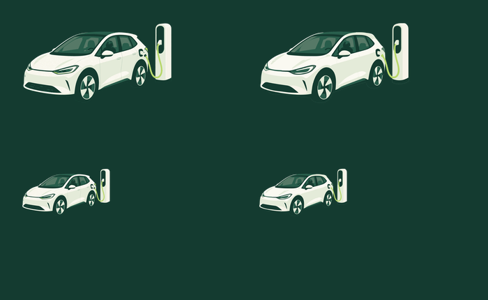

## 运行验证

沿用原有真实服务业务流程和QML加载检查；本轮补充两个手机尺寸的关键几何约束、
大屏新增状态条和地图同步、多站点浏览及大数值边界。验证命令：

```bash
bash scripts/build.sh
bash scripts/test.sh
uv run --with playwright python web/tests/dashboard_smoke.py \
  --url http://127.0.0.1:8080
```

Playwright是可选验收工具，最小Linux环境需先安装Chromium及其系统依赖。

2026-09-05最终验证结果：

| 检查 | 结果 |
| --- | --- |
| `scripts/build.sh` | C++三端、Qt测试程序、TypeScript与Vite生产构建通过 |
| `scripts/test.sh` | C++格式、Ruff、oxlint、oxfmt通过；CTest 5/5通过，35.35秒 |
| 手机业务与布局 | 430×860和360×800真实服务全流程通过；11页加载、48点击区、字号、价格基线、预约倒计时递减检查通过 |
| 在线地图 | 两尺寸腾讯步行路线成功显示；卡内导航真实鼠标点击及返回通过 |
| Chromium大屏 | 两尺寸、88高KPI、七图表、站点双向联动与键盘、七站分页、大数值、空状态恢复、悬停提示、断连保留快照通过；无JavaScript异常 |
| 人工检查 | 逐页查看手机截图及两种大屏尺寸；复核插图、对齐、文案、多站点和空状态 |

在线地图属于需要网络的单独验收，常规离线CI仍运行本地页面和业务流程。
完整业务与老师要求的对照见[验收报告](验收报告.md)。

## 界面截图

大屏截图使用本机C++服务返回的当前业务数据。手机截图使用自动建立、清理的临时数据库，
通过真实服务完成登录、充值、预约、充电和结算，金额随截图时刻的模拟进度变化。
多站点、大数值和空数据的浏览器边界测试使用请求拦截，不向本机业务数据库写入测试数据。

### 大屏

四个核心指标与各站空闲桩在同一行，地图和图表得到更多垂直空间。

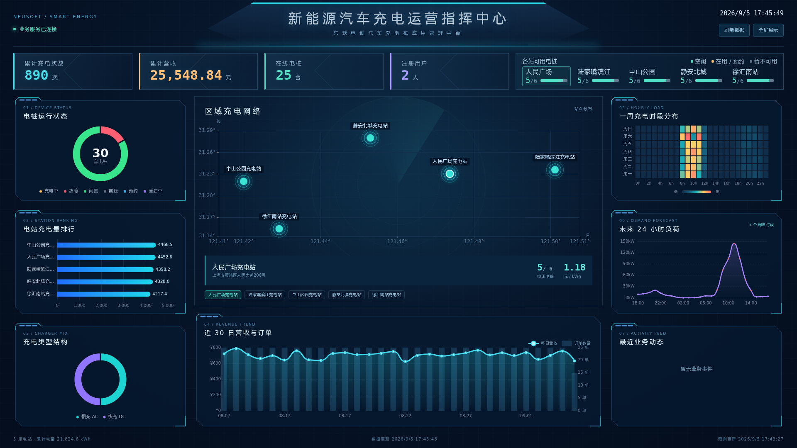

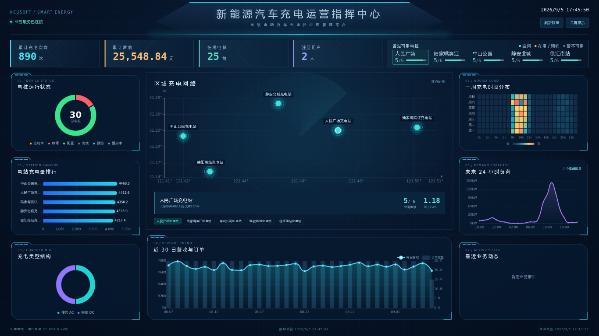

### 手机页面

两种尺寸都保持16页面边距和48操作高度，窄屏不靠缩小字号容纳内容。

| 首页 · 430×860 | 首页 · 360×800 |
| --- | --- |
| 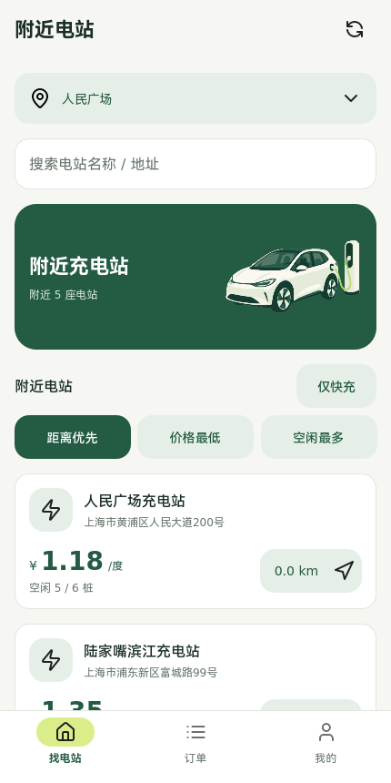 | 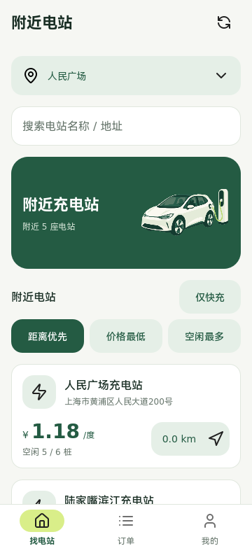 |

| 登录 · 430×860 | 我的 · 360×800 |
| --- | --- |
| 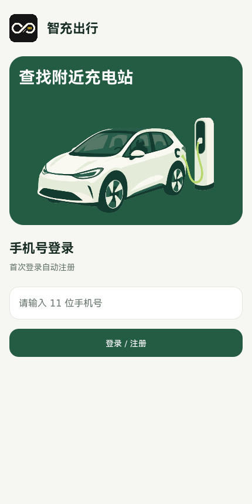 | 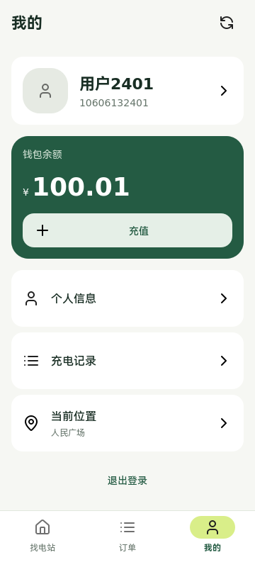 |

| 位置选择 · 360×800 | 个人信息 · 360×800 | 充值 · 430×860 |
| --- | --- | --- |
| 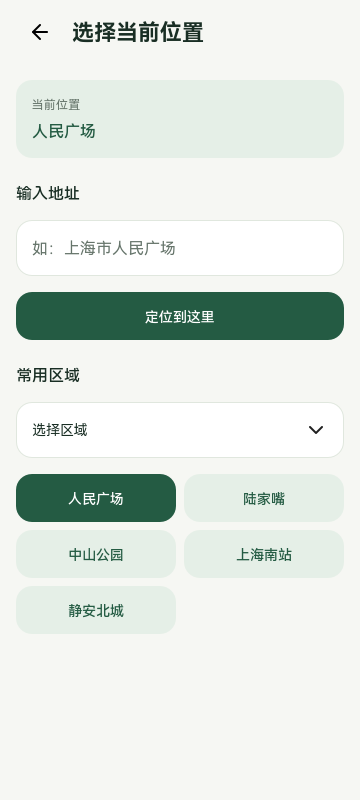 | 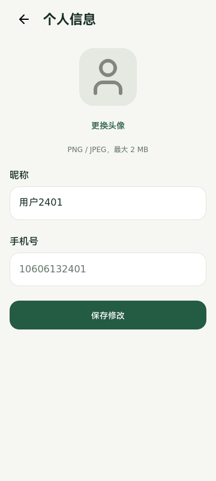 | 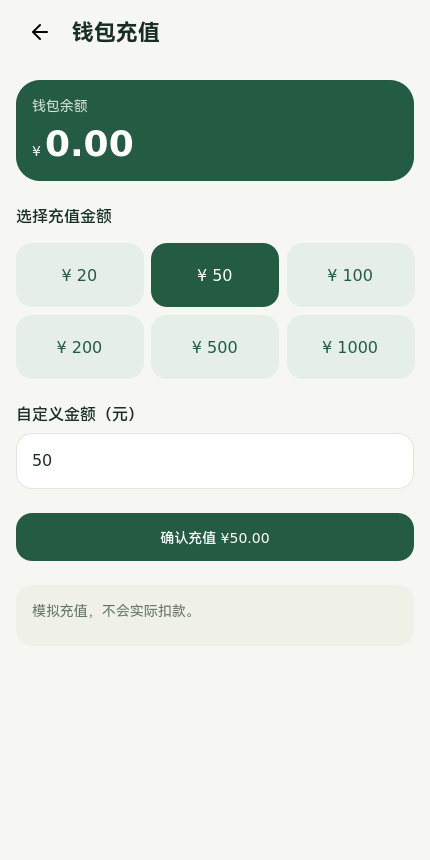 |

| 电站详情 · 360×800 | 充电中 · 430×860 | 充电小票 · 360×800 |
| --- | --- | --- |
| 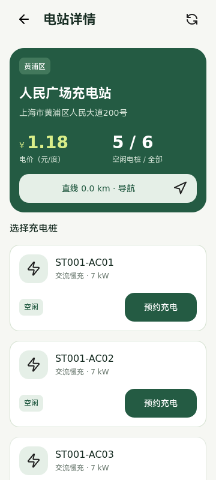 | 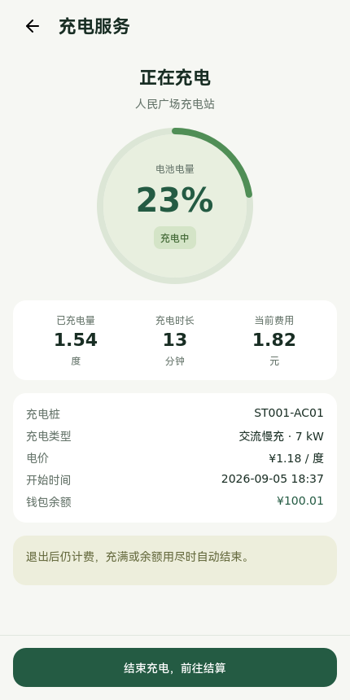 | 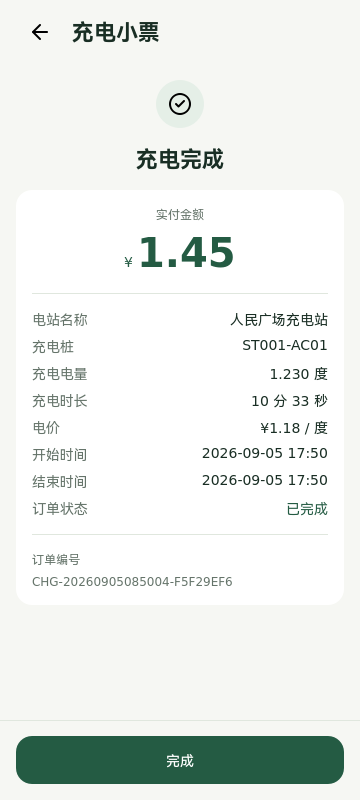 |

内嵌腾讯地图沿用相同的返回图标、64顶部栏、16边距和48操作高度。图中是人民广场至
陆家嘴滨江充电站的实际路线页面，外部地图数据由腾讯提供。

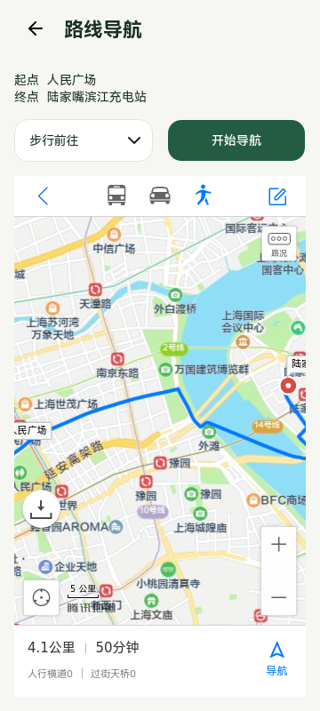

本轮前的[首页](screenshots/mobile-home.png)和[大屏](screenshots/dashboard.png)截图保留，
可直接比较插图、卡片内外间距、金额基线和顶部信息密度的变化。
