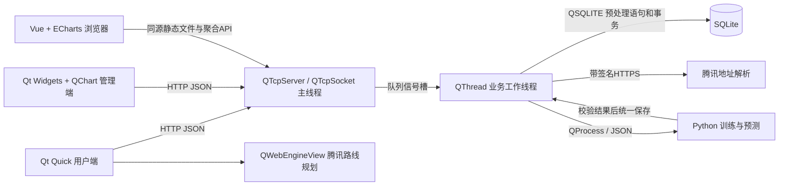
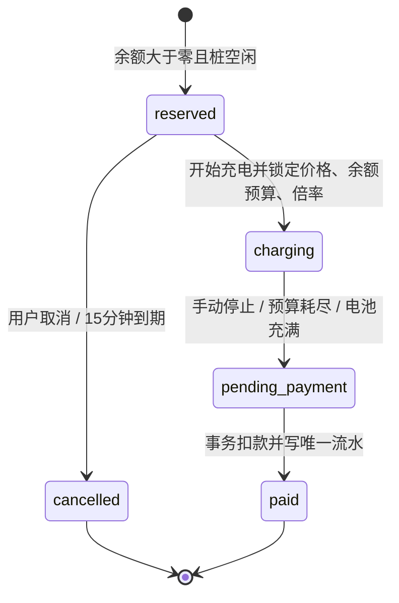

# 系统设计

## 需求解释与架构选择

唯一依据为老师《东软电动汽车充电桩应用管理平台项目要求书》。其1.4标题说“四个”，
实际列出五个子系统，实施与验收按五个处理。1.6明确 SQLite，因此采用 QSQLITE；参考
架构图片中其他存储产品不作为强制依赖。界面图仅供参考，用户端要求模拟手机体验，
使用 Qt Quick 合规；导航明确使用 QWebEngineView，保留该实际组件。管理员仍有独立的
Linux Qt PC 程序，“PC服务器端”的业务能力由管理程序与后台服务共同完成。

两个GUI通过共享 `ApiClient` 的QNetworkAccessManager异步通信。
后台Socket主线程维护连接、
校验 HTTP 长度并托管页面；专用 QThread 拥有唯一 QSQLITE 连接、定时器和业务状态。
Linux 下 QThread 使用原生线程，展示老师要求的多线程结构和线程间消息通信。

SQL 语句的固定结构留在服务端；用户输入全部绑定参数。少量 SQL 条件拼装只选择固定的
白名单片段，字段值不拼入语句。单写线程适合课程规模，配合事务和数据库唯一索引保证
多客户端抢桩、钱包和订单一致性。

## 网络协议与错误

Qt Socket 实现所需的 HTTP/1.1 子集。每连接处理一次请求后关闭，
支持 GET、POST、OPTIONS，拒绝重复头、chunked 和请求流水线，正确缓冲分片请求。
请求头限制16KiB、请求体3MiB、连接超时20秒、最多64条已接受连接。静态路径解析后确认
仍在 `web/dist` 或 `data/uploads` 内，私有配置与数据库不对外提供。

业务使用 `POST /api/rpc`，错误统一 `{ok:false,error:{code,message}}`；GUI 展示中文错误，
保留表单供修正。网络失败不自动重放写操作。充值和预约传 UUID 幂等键，重复键且内容
相同返回原结果，内容不同拒绝。停止、结算等按订单状态天然幂等。

Token 只保存在客户端内存，用户有效期24小时、管理员12小时；退出后失效。重启服务
使会话失效，重新登录后订单仍保留。用户手机号免密登录遵循老师的模拟要求；管理员
密码以随机盐 PBKDF2-SHA256（100000轮）保存，有连续错误尝试限制。普通用户不能调用
管理动作，任何订单动作校验所有者。

默认只监听本机 HTTP。跨机器课堂演示可显式指定监听地址；当前免密手机号机制属于
课程模拟，不应直接部署成公网真实支付服务。上传仅接受大小与像素数受限的 PNG/JPEG，
服务解码后重编码为256像素头像，以随机文件名存储。腾讯 Key / 签名密钥只在后端读取，
前端地图 URL 使用应用名 referer，不携带服务端密钥。

## 订单状态与金额

一位用户最多一个预约、充电中或待支付订单；一根桩最多一个预约或充电中订单。停止时
释放桩并累计次数、电量和时长，结算后才计入营收；重复停止或支付不重复累计。退出
客户端不结束充电，后台按保存的起充时间和倍率继续计算；重启后补算到当前时刻。

模拟60kWh电池、初始电量20%，最多再充48kWh。默认现实1秒相当于充电60秒。
费用使用起充时单价，后续电站调价不影响已开始订单。起充时余额是本次预算上限，
达到上限自动停止；中途充值不自动扩大预算。冻结禁止新登录/预约/开始/充值，已有
会话可停止并结算，以便结束在途业务。

- 钱包和订单金额：整数分，单价分/kWh，展示时转元。
- 电量：整数 Wh，API展示 kWh；时长：整数秒。
- 计费：`(energyWh * priceCents + 500) / 1000` 整数四舍五入，不超过预算。
- 钱包更新、流水、订单 paid、审计同事务提交，任何一步失败全部回滚。
- 已支付小票显示支付后余额，不随后续充值改变。

业务时间以UTC ISO8601保存；营收按中国标准时间的结算日期统计。近7/30日包含今日，
无交易日期填零。充电量排行按已结束会话；热力图按会话跨小时重叠时间分摊，电量守恒。
因此“充电次数/电量”和“已支付营收”统计范围有意不同。

## 预测与生命周期

后台启动后自动预测，每15分钟刷新，可由管理员手动触发；同一时刻最多一个任务。
工作线程用 QProcess 异步调用锁定依赖的 Python，JSON输入不含手机号或昵称。训练及
预测不持有数据库连接；服务校验时间、24个时距、站桩ID、非负有限负荷、空闲范围和
站桩聚合一致性后保存结果。失败保留上次结果并显示错误/生成时间。

预测进程在 Linux 创建独立进程组，180秒超时终止整个组；正常关闭服务会清理 uv 与
Python 子进程，避免退出后继续写预测文件。所有连接关闭后，在工作线程完成清理再
退出线程。业务数据库启用 WAL、外键、busy_timeout，首次结构/管理员/种子初始化是
原子事务，并进行 quick_check。

当前模型、真实数据处理、天气与节假日特征、回测方法和精度边界详见
[analytics.md](analytics.md)。历史较少的桩使用明确标注的基线，低拥堵推荐使用未来一小时
空闲估计并结合当前空闲桩；预测过期会降级为当前可用状态。
