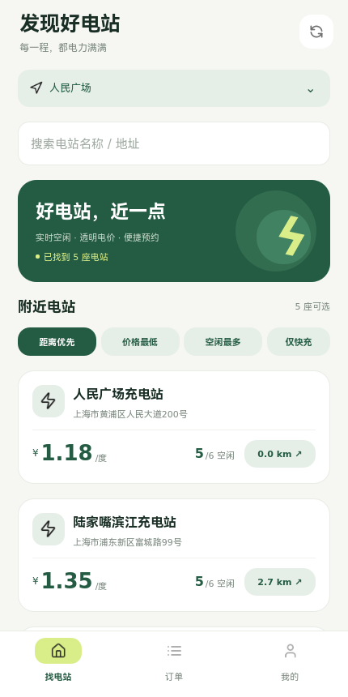
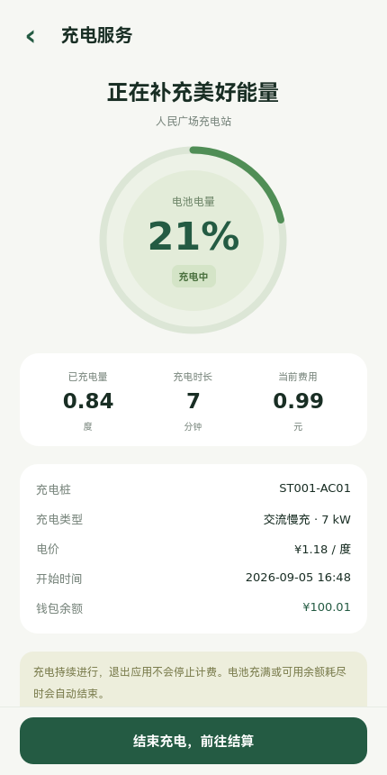
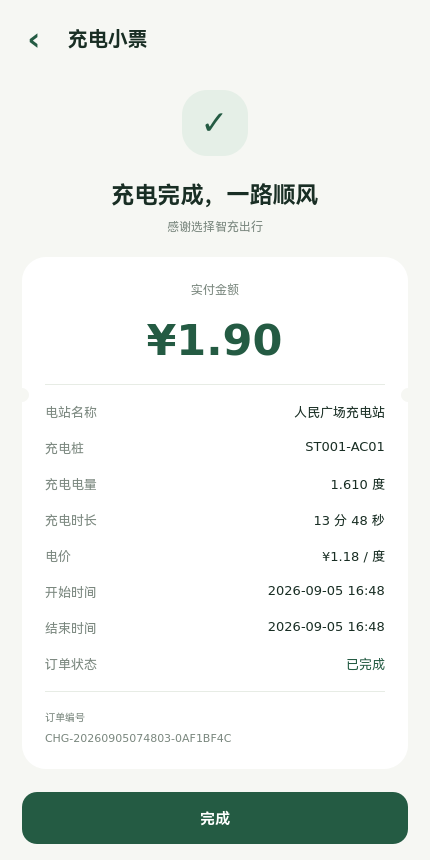
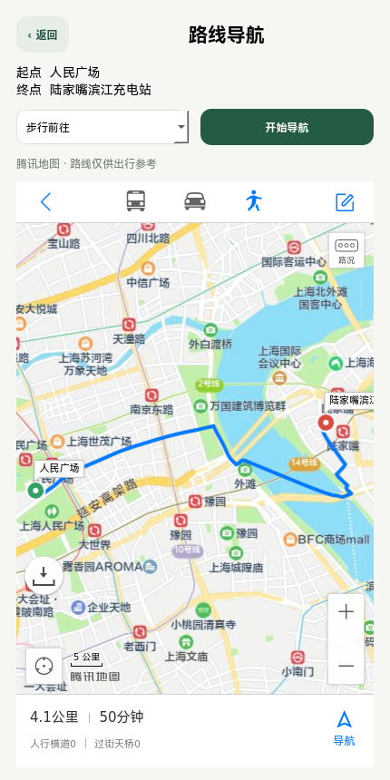
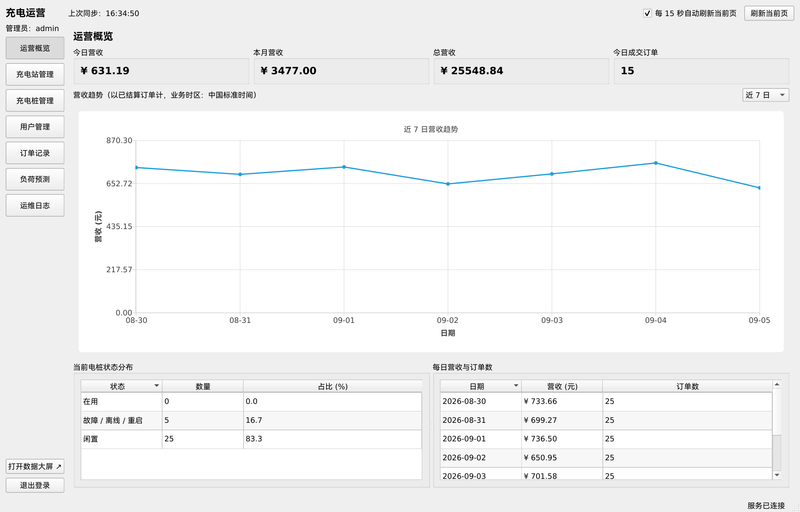
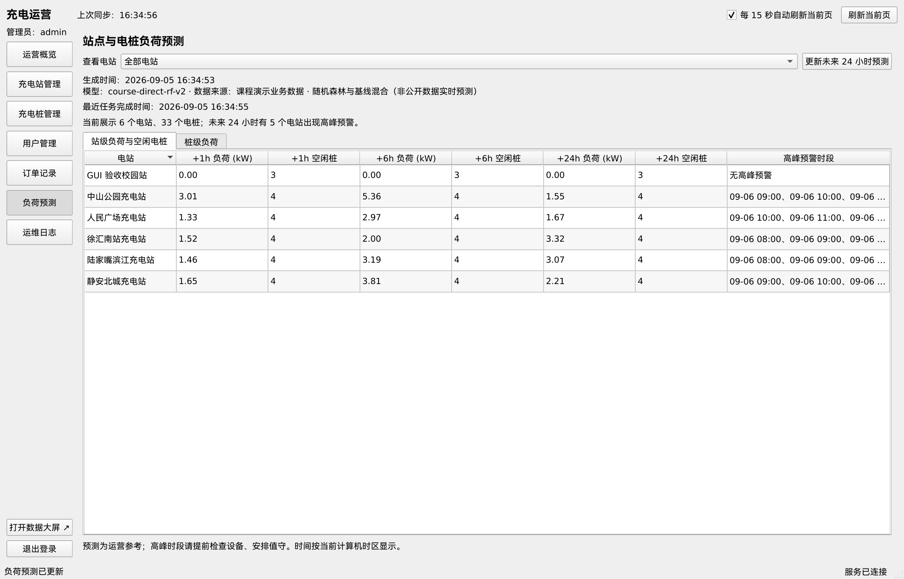
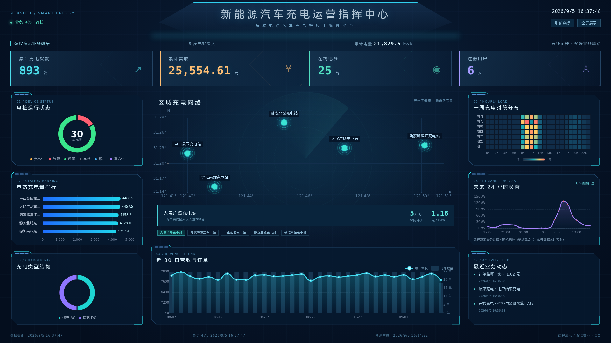

# 验收报告与课堂演示

验收日期：2026-09-05。环境：Linux Ubuntu22.04 / Qt6.2.4 / C++17；依赖由pnpm、uv锁定。
所有业务动作使用统一C++服务。

## 自动验证

```bash
bash scripts/build.sh
bash scripts/test.sh
```

| 检查入口 | 覆盖内容 |
| --- | --- |
| service-integration | 16项pytest：角色/订单归属、整数分钱包及幂等、并发抢桩、完整计费结算、冻结在途订单、预约超时/预算停止、调价快照、站点新增/查询、头像、事务故障回滚、HTTP分片/非法头/路径限制、无种子环境、普通退出与强制终止恢复、预测失败保留有效快照 |
| forecast-unit | 8项pytest：会话小时电量守恒、边界清洗、训练/测试与天气隔离、日历范围、基线与训练分支、24时距、功率/求和边界 |
| admin-ui | QtTest：登录、概览、站/桩管理、用户/订单、预测/日志及退出；使用真实ApiClient和本地测试服务响应 |
| mobile-flow | QtTest真实点击，临时C++服务+SQLite，随机手机号：充值、编辑、预约取消、充电、第二端恢复拦截、停止支付、小票与退出 |
| mobile-qml-smoke | 不依赖在线服务，加载所有手机页面，检查QML组件错误 |
| 静态检查 | clang-format、Ruff、Oxlint、Oxfmt、Web TypeScript+Vite生产构建、ShellCheck、CI配置检查 |

全部测试临时环境自动清理。结算测试同时核对余额、流水数量与营收增量；通过模拟流水
写失败验证整个交易回滚。生命周期用例验证uv及其Python后代随服务退出，不留下继续写
文件的进程，并覆盖SIGKILL后订单恢复及重复结算。

## 实际图形与跨端验收

- 用户端：真实QML操作完成0.01元及100元充值、昵称保存、取消预约、开始充电、另一客户端
  拦截未完成订单、结算、小票和记录；没有QML运行时错误。截图为真实程序渲染。
- 管理端：直接连接真实服务，完成建站建桩、设备重启、冻结/解冻、订单查询、7/30日趋势、
  运行真实Python预测、站/桩时距显示、日志和退出。
- 大屏：Chromium在1920×1080与1366×768均无滚动/遮挡和JavaScript异常，站点选择可交互，
  后端断连后保留快照并显示状态。实际充电结算276分后次数+1、营收+2.76元，页面同步刷新。
- 地图：签名地址解析最初探测成功；随后服务联调时腾讯返回121“此key每日调用量已达到
  上限”，客户端已显示具体额度提示。内嵌QWebEngineView仍实际完成人民广场到陆家嘴
  的步行路线，腾讯页面显示4.1公里/50分钟。导航页与WebService配额是独立外部服务条件。
- 预测：当前五站三十桩输出完整，服务验证后持久保存；25桩训练、5故障桩基线/零负荷，
  各小时站点负荷与桩级求和一致，首页推荐和运营相对高峰标签可见。

大屏浏览器验收可复跑：

```bash
uv run --with playwright python -m playwright install chromium
uv run --with playwright python web/tests/dashboard_smoke.py --url http://127.0.0.1:8080
```

浏览器自动验收使用Playwright。最小Linux环境需补齐Chromium系统依赖。









## 10分钟课堂演示顺序

1. 展示老师要求与需求对照表，说明Qt手机端、管理端、C++服务和大屏同源共享SQLite；启动
   后台，展示LISTENING和服务日志，浏览器打开大屏。
2. 管理端用admin/123456登录，切换7/30日趋势，查看站点、桩状态和预测。首次模型未完成
   时点击运行预测，稍后回来展示结果。
3. 用户端输入新的11位手机号，说明自动注册，修改昵称/头像，先充0.01元验证最小金额，
   再充100元。选择预设区域，观察距离排序；如Key配额恢复，演示输入地址解析。
4. 打开站点查看全部桩，点击距离进入内嵌腾讯地图，切换驾车/步行并展示路线。
5. 选空闲桩预约，先取消一次，再预约并起充，展示电量/时长/费用随服务计时变化。
6. 新开第二个用户端登录同手机号，再进入充电流程，展示未完成订单弹窗和结算处理页；
   停止并支付，展示订单小票及余额。管理端营收和大屏在刷新后同步变化。
7. 管理端尝试重启占用桩，展示拒绝；选择空闲桩重启，观察重启中到空闲、日志落库。
   新增一个站点及四个桩，用户端刷新后可见。
8. 搜索用户手机号、冻结/解冻；展示冻结不能开始新订单，已在途仍可停止结算。
9. 展示预测的1/6/24小时、站/桩分层、相对高峰提示；说明历史不足使用基线，实际天气
   尚未接入当前业务，公开回测使用真实天气。
10. 展示自动验收结果、数据库唯一占用索引/整数分钱包与回测报告，说明项目技术边界。

如需每次相同初始状态，先停止服务并换一个新的 `--data-dir`，不要删除已有演示记录。
地图配置需放入新目录；大屏数据随初始化日期变化，测试按业务增量核对数值。

## 已知边界

系统按课程要求模拟手机号免密登录、支付、充电设备和GPS。当前后台是适合课堂规模的
单数据库工作线程，订单列表最多返回最近1000笔、运维日志200条，未做生产级分页与外网
部署。

当前业务天气源缺失会明确标记，公开嘉兴回测采用前一已结束自然日的真实天气；固定
随机森林1/6/24h MAE为27.2004 / 27.6398 / 27.9880kW，未超过周周期基线。
完整数据与方法见 `ml/reports/jiaxing/report.md`。
腾讯地址解析需要有效Key和剩余配额，课堂演示前应检查，预设区域可保证基本找桩流程。
